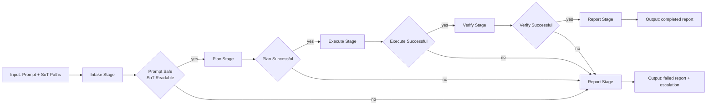
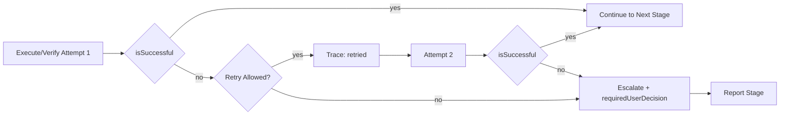
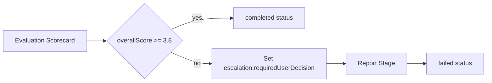

# Agent Workflow Architecture

This document describes the deterministic agent workflow runtime:

- input: prompt + source-of-truth paths,
- stages: `intake -> plan -> execute -> verify -> report`,
- outputs: structured report with artifacts, scorecard, and optional escalation.

Observability data is emitted as:

- `observations` (per stage attempt),
- `traceEvents` (started/succeeded/failed/retried/escalated),
- `evaluationScorecard` (stage + overall five-point scores),
- `verificationChecks` (gate outcomes).

## Happy Path

Observability points:

1. Intake: `isPromptSafe`, `isSourceOfTruthReachable`.
2. Execute/Verify: attempt-level observations and retry counters.
3. Report: serialization check and final status.

## Failure and Retry Path

Conditions:

1. Retry is allowed only for `execute` and `verify`.
2. Maximum retries per stage: `1`.
3. After second failure, escalation is mandatory.

## Governance and Escalation Path

Governance gate:

1. If `overallScore < 3.8`, workflow MUST escalate even if stage execution succeeded.
2. Escalation MUST include a concrete `requiredUserDecision`.
3. Report output MUST remain machine-readable and include scorecard evidence.

